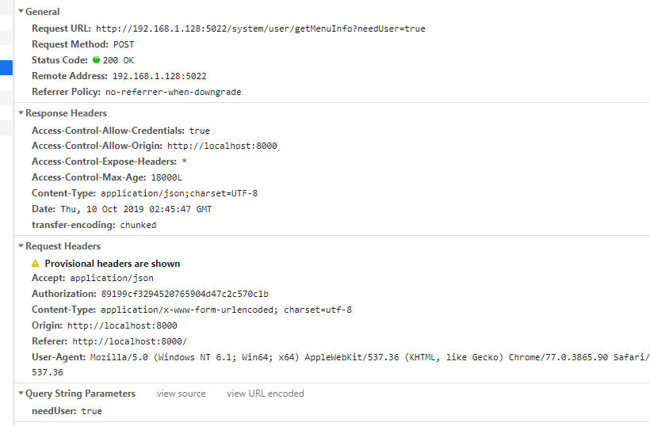
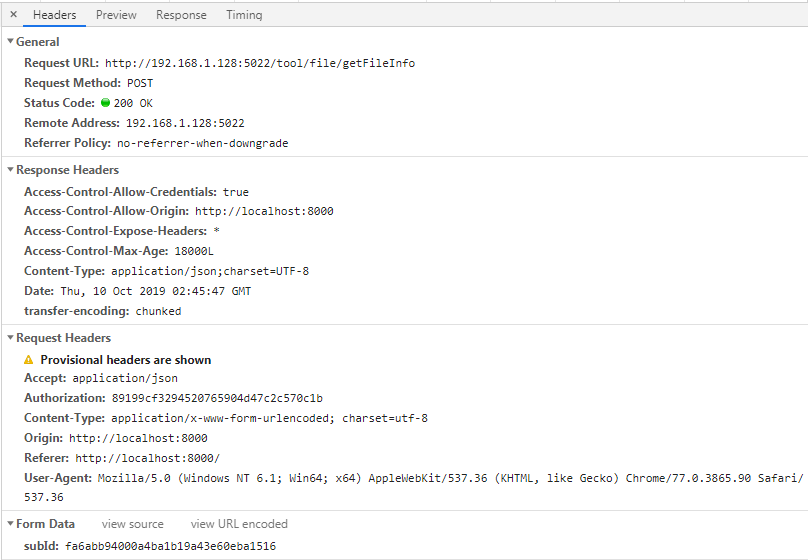
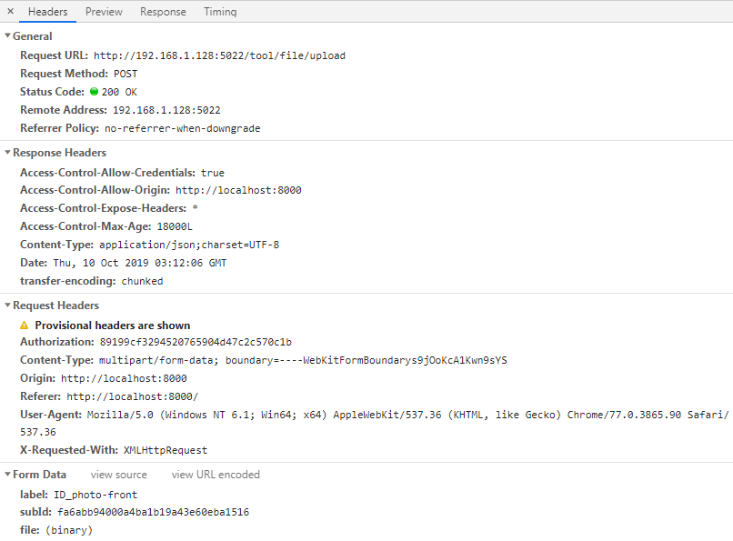
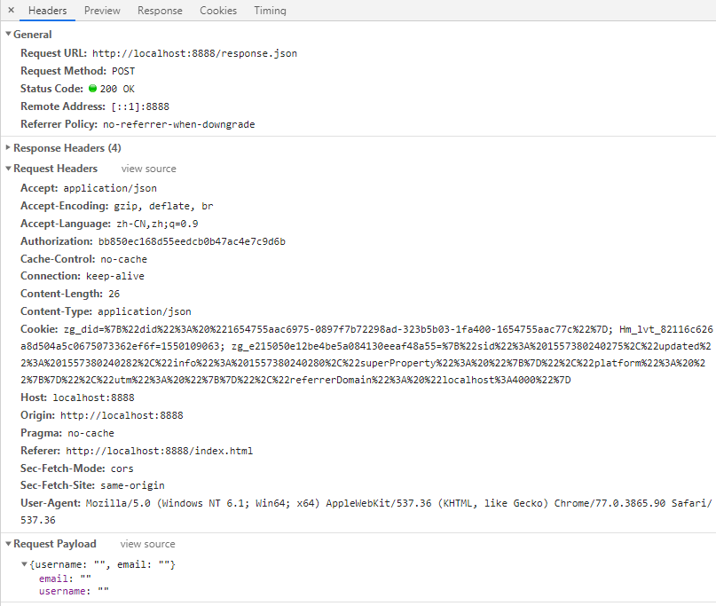

## HTTP 请求参数之三种格式

下面内容是关于 `Query String Parameters`、`Form Data`、 `Request Payload` 三种格式的区别。主要是因为 `Content-Type` 与请求方式 `method` 不同，导致传递的数据格式不同。

### Content-Type: [media-type];[charset];boundary

原生 ajax 请求默认 `Content-Type: text/plain;charset=UTF-8`

常见的媒体格式：

| 媒体格式 | 描述 |
| :-------------------------------- | :--------- |
| text/html                         |  HTML格式  |
| text/plain                        | 纯文本格式，不包含任何控件或格式字符  |
| text/xml                          |   XML格式  |
| image/gif                         | gif图片格式  |
| image/jpeg                        | jpg图片格式  |
| image/png                         | png图片格式  |
| application/xhtml+xml             | XHTML格式  |
| application/xml                   |  XML数据格式  |
| application/atom+xml              | Atom XML聚合格式  |
| application/json                  |  JSON数据格式  |
| application/pdf                   | pdf格式  |
| application/msword                |  Word文档格式  |
| application/octet-stream          |  二进制流数据（如常见的文件下载）  |
| application/x-www-form-urlencoded |  默认的encType，form 表单数据被编码为 key/value 格式发送到服务器（表单默认的提交数据的格式）。数据被编码为名称/值对。这是标准的编码格式。  |
| multipart/form-data               | 数据被编码为一条消息，页上的每个控件对应消息中的一个部分，用在上传文件: Content-Type: multipart/form-data; boundary=----WebKitFormBoundarys9jOoKcA1Kwn9sYS  |

### 请求参数格式

1. `Query String Parameters` 格式： `?key=value&key=value`

    参数会以 url string 的形式进行传递，即?后的字符串则为其请求参数，并以&作为分隔符。常用在 GET 请求方式时使用。 其他请求方式也可以使用，拼接在接口地址 `url?` 后面。

    

2. `Form Data` 格式：`key=value&key=value` 键值对形式

    - 当 `Content-type` 为 `application/x-www-form-urlencoded;charset=utf-8` 时，参数会以 `Form Data` 的形式(数据为 String 键值对格式)传递给接口，并且不会显示在接口 url 上。

    ```js
    let data = {
        username: 'wqjiao',
        password: '111111',
    }
    xhr.send(JSON.stringify(data));
    ```
    

    - 对表单提交和文件上传时做特殊处理，需要使用 `new FormData()` 方法处理后传递给接口，`Content-type` 为 `multipart/form-data; boundary=----WebKitFormBoundarys9jOoKcA1Kwn9sYS` 格式。

    ```js
    const formData = new FormData();
    formData.append('label', 'ID_photo-front');
    formData.append('subId', 'fa6abb94000a4ba1b19a43e60eba1516');
    formData.append('file', fileList[0]);

    fetch('http://192.168.1.128:5022/tool/file/upload', {
        method: 'POST',
        headers: {
            'Authorization': '89199cf3294520765904d47c2c570c1b',
        },
        body: formData,
        cridentials: 'include',
        mode: 'no-cors',
        processData: false,
        cache: false,
        contentType: false,
    });
    ```

    

    - 补充说明

        1. `服务器为什么会对表单提交和文件上传做特殊处理，因为表单提交数据是名值对的方式，且Content-Type为application/x-www-form-urlencoded,而文件上传服务器需要特殊处理，普通的post请求（Content-Type不是application/x-www-form-urlencoded）数据格式不固定，不一定是名值对的方式，所以服务器无法知道具体的处理方式，所以只能通过获取原始数据流的方式来进行解析。`
        2. processData: false --> 因为 data 值是 `formdata` 对象，不需要对数据做处理。
        3. cache: false --> 上传文件不需要缓存。
        4. contentType: false --> 因为是由 `<form>` 表单构造的 `FormData` 对象，且已经声明了属性 `enctype="multipart/form-data"`，所以这里设置为 false。
        5. xhrFields: { withCredentials: true }, 跨域请求设置

3. `Request Payload` 格式：`{key: value, key: value}` (后端经过反序列化得到对象)

    当 `Content-type` 为 `application/json;charset=utf-8` 时，参数会以 `Request Payload` 的形式(数据为 json 格式)传递给接口，并且不会显示在接口 url 上。

    ```js
    let data = {
        username: 'wqjiao',
        password: '111111',
    }
    xhr.send(Qs.stringify(data));
    ```

    

### new FormData(form)

1. 获取数据

    - 获取一个控件的 value ：`formData.get('name');`
    - 获取一组控件 name 为 username 的 values，返回数组 ：`formData.getAll('username');`

2. 添加数据 `formData.append('username', 'qq');`

3. 设置修改数据 `formData.set("username", 'wqjiao');`

    注意：如果 `formData` 中不存在 username 字段，那么，js不会报错，而是直接新增当前键值对。

4. 判断是否存在该数据，返回 Boolean 类型 `formData.has('username');`

5. 删除某数据 `formData.delete('username');`

6. 返回所有的键值对：`formData.entries()`

    `formData.entries()` 方法返回一个 [iterator](https://developer.mozilla.org/zh-CN/docs/Web/JavaScript/Reference/Iteration_protocols) 对象 ，此对象可以遍历访问 `formData` 中的键值对。其中键值对的 key 是一个 [USVString](https://developer.mozilla.org/zh-CN/docs/Web/API/USVString) 对象；value 是一个 [USVString](https://developer.mozilla.org/zh-CN/docs/Web/API/USVString) , 或者 [Blob](https://developer.mozilla.org/zh-CN/docs/Web/API/Blob) 对象。

7. 实例

    ```html
    <form id="myForm">
        <input type="text" name="name" placeholder="请输入你的名字" />
        <input type="password" name="password" placeholder="请输入你的密码" />

        <input type="text" name="n1" />
        <input type="text" name="n1" />

        <input type="submit" id="submitBtn" value="提交" />
    </form>
    <script>
        // 表单初始化
        let form = document.getElementById('myForm');
        let submitBtn = document.getElementById('submitBtn');

        submitBtn.addEventListener('click', function (e) {
            e.preventDefault();

            let formData = new FormData(form);
            // 获取数据
            let name = formData.get('name');
            let arr = formData.getAll('n1');
    
            // 添加数据
            formData.append('username', 'wqjiao');
            // 判断是否存在 name 为 deletename
            if (formData.has('deletename')) {
                // 修改数据
                formData.set("deletename", '123456');
            }

            // 删除数据
            formData.delete('password');

            // 返回所有的数据，遇到重复的 name,保留最新的值
            let data = {};
            for(let name of formData.entries()) {
                if (name) {
                    data[name[0]] = name[1];
                }
            }

            console.log(name, arr, data);

            // 请求接口
            let xhr = new XMLHttpRequest();
            xhr.open('POST', 'response.json', true);
            xhr.send(formData);
            
        }, false);

    </script>
    ```

### 推荐阅读

* [FormDta MDN web docs](https://developer.mozilla.org/zh-CN/docs/Web/API/FormData)
* [Form Data 与 Request Payload](https://github.com/kaola-fed/blog/issues/105)
