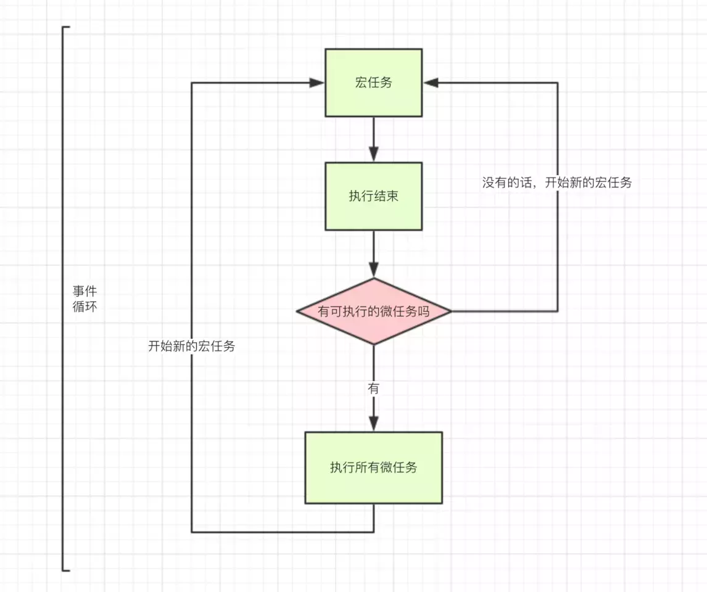
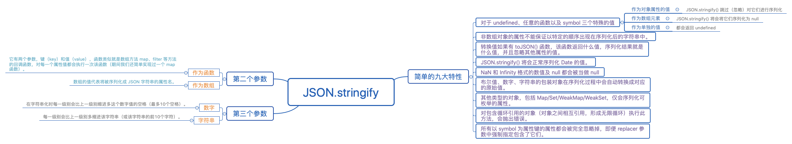

# 关于 Javascript 相关问题

* [防抖节流](./防抖节流.md)
* [获取网页相对边距](./获取网页相对边距.md)
* [压缩图片上传](./压缩图片上传.md)
* [Console用法](./Console.md)
* [自定义js事件](./CustomEvent.md)
* [DOM方法](./DOMMethods.md)
* [ImageToBase64](./ImageToBase64.md)
* [IsNaN](./IsNaN.md)
* [ParseInt](./ParseInt.md)
* [RegExp](./RegExp.md)
* [前端题目](./Topic.md)

## 1.宽松相等与严格相等的区别

* 宽松相等

```js
const a = { value : 0 };
a.valueOf = function() {
    return this.value += 1;
};

console.log(a == 1 && a == 2 && a == 3); // true
```
    
注意：
    宽松相等 == 会先将左右两两边的值转化成相同的原始类型，然后再去比较他们是否相等。
    在转化之后( == 一边或两边都需要转化)，最后的相等匹配会像 === 符号一样去执行判断。
    宽松相等是可逆的，对于任何值 A 与 B，通常 A == B 与 B == A 具有相同的表现(除了转换的顺序不同)。

    ToPrimitive(input, PreferredType?)
        
可选参数 PreferredType 可以指定最终转化的类型，它可以是 Number 类型或 String 类型，
这依赖于 ToPrimitive() 方法执行的结果返回的是 Number 类型或 String 类型

```js
const ToPrimitive = (obj, preferredType='Number') => {
    let Utils = {
        typeOf: function(obj) {
            return Object.prototype.toString.call(obj).slice(8, -1);
        },
        isPrimitive: function(obj) {
            let types = ['Null', 'String', 'Boolean', 'Undefined', 'Number'];
            return types.indexOf(this.typeOf(obj)) !== -1;
        }
    };
   
    if (Utils.isPrimitive(obj)) {
        return obj;
    }
    
    preferredType = (preferredType === 'String' || Utils.typeOf(obj) === 'Date') ?
     'String' : 'Number';

    if (preferredType === 'Number') {
        if (Utils.isPrimitive(obj.valueOf())) {
            return obj.valueOf()
        };
        if (Utils.isPrimitive(obj.toString())) {
            return obj.toString()
        };
    } else {
        if (Utils.isPrimitive(obj.toString())) {
            return obj.toString()
        };
        if (Utils.isPrimitive(obj.valueOf())) {
            return obj.valueOf()
        };
    }
}

let a = {};
ToPrimitive(a); // "[object Object]",与上面文字分析的一致
```

* 严格相等

```js
var value = 0; // window.value
Object.defineProperty(window, 'a', {
    get: function() {
        return this.value += 1;
    }
});

console.log(a === 1 && a === 2 && a === 3) // true
```

注意：这里声明的 value 变量不能使用 let 定义变量，否则结果就是 false，因为从 ES6 开始，全局变量和顶层对象的属性开始分离、脱钩。

* 类型固定时，宽松相等 与 严格相等

```js
var value = 0; // window.value 变量定义同上
const a = {
    get: function() {
        return this.value += 1;
    }
}

// 或者将上面代码替换成：
const a = {
	value: 0,
    get: () => {
        return a.value += 1;
    }
}

console.log((0, a.get)() == 1 && (0, a.get)() == 2 && (0, a.get)() == 3); // true
console.log((0, a.get)() === 1 && (0, a.get)() === 2 && (0, a.get)() === 3); // true
```

* Object.defineProperty

    - 语法
    
        Object.defineProperty(obj, prop, descriptor)
    
    - 参数
    
        obj 用于定义属性的对象。
    
        prop Symbol 要定义或修改的名称或属性。
    
        descriptor 正在定义或修改属性的描述符。
    
    - 返回值
    
        传递给函数的对象

* 参考链接
    - [gist.github](https://gist.github.com/anubhavsrivastava)
    - [掘金](https://juejin.im/post/5bfcc632f265da61493353cc)
    - [web docs](https://developer.mozilla.org/en-US/docs/Web/JavaScript/Reference/Global_Objects/Object/defineProperty)

## 2.React click 事件对比

类的方法默认不会自动绑定 this，在调用时如果忘记绑定 this，那么 this 的值将会是 undefined。
通常如果不是直接调用，应该为方法绑定 this。绑定方式有以下几种：

* 1、在 onClick 时使用匿名(箭头)函数绑定
    ```
    <button onClick={() => this.handleClick()}>按钮</button>

    <!-- 传参 -- 该方法 点击 时才会执行 -->
    <button onClick={() => this.handleClick(data)}>按钮</button>
    ```

* 2、在 onClick 时使用 bind 绑定 this

Function.prototype.bind 来为事件处理函数传递参数
    ```
    handleClick() {
        alert('我点击了按钮');
    }
    ...
    <button onClick={this.handleClick.bind(this)}>按钮</button>

    <!-- 传参 -- 该方法 点击 时才会执行 -->
    <button onClick={this.handleClick.bind(this)}>按钮</button>
    ```

* 3、在构造函数中使用 bind 绑定上下文

    ```
    constructor(props) {
        super(props);
        this.handleClick = this.handleClick.bind(this);
    }
    ...
    handleClick() {
        alert('我点击了按钮');
    }
    ...
    <button onClick={this.handleClick}>按钮</button>

    <!-- 传参 -- 该方法在 render 时会直接被执行 -->
    <button onClick={this.handleClick(data)}>按钮</button>
    ```

* 4、使用属性初始化器语法(箭头函数)绑定 onClick

    ```
    handleClick = () => {
        alert('我点击了按钮');
    }
    ...
    <button onClick={this.handleClick}>按钮</button>

    <!-- 传参 -- 该方法在 render 时会直接被执行 -->
    <button onClick={this.handleClick(data)}>按钮</button>
    ```

* 总结

    - 方式1 和 方式2：
        
        在 onClick 时绑定this，影响性能，且当方法作为属性传递给子组件的时候会引起重渲问题

        优点：写法比较简单，当组件中没有 state 的时候就不需要添加类构造函数来绑定 this，`传参 -- 该方法 点击 时才会执行`

        缺点：每一次调用的时候都会生成一个新的方法实例，因此对性能有影响，且当这个函数作为属性值传入低阶组件的时候，这些组件可能会进行额外的重新渲染，因为每一次都是新的方法实例作为的新的属性传递。

    - 方式3：
        
        在类构造函数中绑定 this，调用的时候不需要再绑定，官方推荐的绑定方式，性能最好的方式

        优点：只会生成一个方法实例，并且绑定一次之后如果多次用到这个方法也不需要再绑定。

        缺点：即使不用到 state，也需要添加类构造函数来绑定 this，代码量多。

    - 方式4：
        
        利用属性初始化语法，将方法初始化为箭头函数，因此在创建函数的时候就绑定了 this，最好的方式

        优点：创建方法就绑定 this，不需要在类构造函数中绑定，调用的时候不需要再作绑定，结合了前三种方式的优点。
        
        缺点：需要用 babel 转译

    - 方式3 和 方式4：
        
        `共同缺点：传参 -- 该方法在 render 时会直接被执行`

    - 传参
    
        向方法中传参时，使用 方法1 箭头函数(arrow functions) 和 方法2 bind(Function.prototype.bind)

        事件对象 e 要放在最后 handleClick(data, e)，作为第二个参数传递

        通过箭头函数的方式，事件对象必须显式的进行传递，但是通过 bind 的方式，事件对象以及更多的参数将会被隐式的进行传递

## 3.Number 与 String 转换

* Number 转换成 String

    '' + 1 => '1'
    1.toString()

    性能上来说：('' +) > String() > .toString() > new String()

* String 转换成 Number

    + '1'; // + 连接操作符
    ~~'15'; // 15 ~~ 双非运算符，返回一个整数(~按位非运算)
    Number('1');
    parseFloat('1');
    parseInt('1');

    另外，可以使用 `+` 运算实现 `boolean` 类型转换成 `number`:
    
    +true; // 1
    +false; // 0

* 浮点数 Float 转换成整型 Int

    最常用的是 parseInt()，其实 parseInt() 是用于将字符串转换成数字，而不是浮点数和整型之间的转换，可以使用 Math.ceil()、 Math.floor() 或者 Math.round()。

    Math.ceil(num)  数值上取整
    Math.floor(num) 数值下取整
    Math.round(num) 数值四舍五入

## 4.target 与 currentTarget 区别

    currentTarget 始终是指向时间绑定的元素(监听事件者);
    target 指向用户触发的元素(真正发出者)。

## 5.运算符 - + ~~

* 一元负号 `-`

    一元负号运算符位于操作数前面，并转换操作数的符号
    ```js
    -'55' -> -55
    -(-'55') -> 55
    ```
    注意：一元负号会将数值变成负数，如果不想变成负数，需要在前面再添加一个 `-`(注意运算符优先级)。

* 一元正号 `+`

    一元正号运算符位于其操作数前面，计算其操作数的数值，如果操作数不是一个数值，会尝试将其转换成一个数值。 尽管一元负号也能转换非数值类型，但是一元正号是转换其他对象到数值的最快方法，也是最推荐的做法，因为它不会对数值执行任何多余操作。它可以将字符串转换成整数和浮点数形式，也可以转换非字符串值 true，false 和 null。小数和十六进制格式字符串也可以转换成数值。负数形式字符串也可以转换成数值（对于十六进制不适用）。如果它不能解析一个值，则计算结果为 NaN。
    ```js
    +'55' -> 55
    ```

* 双非运算符 `~~`

    `~~` 返回一个整数(~按位非运算)
    ```js
    ~~'15' -> 15
    ```

## 6.js 判断对象是否为空

* 1、将 json 对象转化为 json 字符串，再判断该字符串是否为 "{}"

    var data = {};
    var b = (JSON.stringify(data) == "{}");
    alert(b); // true

    注意： 忽略转换 undefined、function、Symbol 属性

    JSON.stringify({[Symbol("key")]: "foo"}); // {}

* 2、for in 循环判断

    var obj = {};
    var b = function() {
        for(var key in obj) {
            return false;
        }
        return true;
    }
    alert(b()); // true

* 3、jquery 的 isEmptyObject()

    此方法是 jquery 将 2 方法 (for in) 进行封装，使用时需要依赖 jquery

    var data = {};
    var b = $.isEmptyObject(data);
    alert(b); // true

* 4、Object.getOwnPropertyNames()

    获取到对象中的属性名，存到一个数组中，返回数组对象，我们可以通过判断数组的 length 来判断此对象是否为空

    var data = {};
    var arr = Object.getOwnPropertyNames(data);
    alert(arr.length === 0); // true

    注意：此方法不兼容 IE8

* 5、使用 ES6 的 Object.keys()

    与 4 方法类似，是 ES6 的新方法, 返回值也是对象中属性名组成的数组

    var data = {};
    var arr = Object.keys(data);
    alert(arr.length === 0); // true

## 7.js 遍历对象

* 1、for in

    循环遍历对象自身的和继承的可枚举属性(不含 Symbol 属性)

    var obj = {'0': 'a', '1': 'b', '2': 'c'};

    for (var i in obj) {
        console.log(i, obj[i]);
    }

* 2、Object.getOwnPropertyNames()

    返回一个数组,包含对象自身的所有属性(不含 Symbol 属性,但是包括不可枚举属性).

    var obj = {'0': 'a', '1': 'b', '2': 'c'};

    Object.getOwnPropertyNames(obj).forEach((key) => {
        console.log(key, obj[key]);
    });

* 3、Object.keys()

    返回一个数组,包括对象自身的(不含继承的)所有可枚举属性(不含 Symbol 属性)

    var obj = {'0': 'a', '1': 'b', '2': 'c'};

    Object.keys(obj).forEach((key) => {
        console.log(key, obj[key]);
    });

* 4、Reflect.ownKeys()

    返回一个数组,包含对象自身的所有属性,不管属性名是 Symbol 或字符串,也不管是否可枚举

    var obj = {'0': 'a', '1': 'b', '2': 'c'};

    Reflect.ownKeys(obj).forEach(function(key) {
        console.log(key, obj[key]);
    });

## 8.js 遍历数组

* 1、for

    var arr = [1, 2, 3];

    for (var i = 0; i < arr.length; i ++) {
        console.log(i, arr[i]);
    }

* 2、forEach

    var arr = [1, 2, 3];

    arr.forEach(function(val, index) {
        console.log(val, index);
    });

* 3、for in

    var arr = [1, 2, 3];

    for (var i in arr) {
        console.log(i, arr[i]);
    }

* 4、for of

    不仅支持数组，还支持大多数类数组对象

    也支持字符串遍历，它将字符串视为一系列的 Unicode 字符来进行遍历

    var arr = [1, 2, 3];

    for (var value of arr) {
        console.log(value);
    }

* 5、数组/对象数组中获取 id

    let arr = [{
        id: 0,
        text: 'a'
    }, {
        id: 1,
        text: 'b'
    }];

    // map()/filer()
    let str = arr.map( (item) => {
        return [item.id]; // 字符串、数组、对象
    });

## 9.js 删除数组中某一项或几项

### splice
替换/删除/添加数，该方法会改变原始数组

splice(index, len, [item]);

index: 数组开始下标
len: 替换/删除的长度
item: 替换的值，删除操作的话 item 为空

* 删除 -- item 不设置

```javascript
let arr = ['a','b','c','d'];
// 删除起始下标为1，长度为1的一个值，len设置的1，如果为0，则数组不变
arr.splice(1, 1); // ['a','c','d'] 
// 删除起始下标为 1，长度为 2 的一个值，len 设置的 2
arr.splice(1, 2); // ['a','d']
```

* 替换 -- item 为替换的值

```javascript
let arr = ['a','b','c','d'];
// 替换起始下标为 1，长度为 1 的一个值为 'ttt'，len 设置的 1
arr.splice(1, 1, 'ttt'); // ['a','ttt','c','d']
// 替换起始下标为1，长度为2的两个值为'ttt'，len设置的1
arr.splice(1, 2, 'ttt'); // ['a','ttt','d']         
```

* 添加 -- len 设置为 0，item 为添加的值

```javascript
let arr = ['a','b','c','d'];
// 表示在下标为 1 处添加一项 'ttt'
arr.splice(1, 0, 'ttt'); // ['a','ttt','b','c','d']
```

### slice

* 数组截断

```js
let array = [0, 1, 2, 3, 4, 5, 6, 7, 8, 9];
array = array.slice(0, 4); // [0, 1, 2, 3]
```

* 获取数组中的最后一项

`slice()` 可以接受负数,表示它将接受数组末尾的值
```js
let arr = [1, 5, 8, 9,56];
console.log(arr.slice(-1)); // [56]
console.log(arr.slice(-2)); // [9, 56]
```
    
### delete
delete 删除掉数组中的元素后，会把该下标出的值置为undefined,数组的长度不会变，优势：原数组的索引也保持不变，此时再遍历数组元素，会跳过其中 undefined 的元素

```javascript
let arr = ['a','b','c','d'];

for (index in arr) {
    document.write('arr[' + index + ']='+arr[index]);
}

// 中间出现两个逗号，数组长度不变，有一项为 undefined
delete arr[1]  //['a', ,'c','d']
```

## 10.js 字符串截取


string str = "123abc456";
int i = 3;

* 1、取字符串的前 i 个字符

str=str.Substring(0,i); // or  str=str.Remove(i,str.Length-i); 

* 2、去掉字符串的前i个字符：
   
str=str.Remove(0,i);  // or str=str.Substring(i); 

* 3、从右边开始取i个字符：
  
str=str.Substring(str.Length-i); // or str=str.Remove(0,str.Length-i);

* 4、从右边开始去掉i个字符：
   
str=str.Substring(0,str.Length-i); // or str=str.Remove(str.Length-i,i);

* 5、判断字符串中是否有"abc" 有则去掉之

```javascript
string str = "123abc456";
string a="abc";
Regex r = new  Regex(a); 
Match m = r.Match(str);

if (m.Success) {
    //绿色部分与紫色部分取一种即可。
    str=str.Replace(a,"");
    Response.Write(str);   
    string str1, str2;
    str1=str.Substring(0, m.Index);
    str2=str.Substring(m.Index + a.Length, str.Length - a.Length - m.Index);
    Response.Write(str1 + str2); 
}
```

* 6、如果字符串中有"abc"则替换成"ABC"

   ·str=str.Replace("abc","ABC");

* 7、截取指定字符区间

string str="adcdef";

int indexStart = str.IndexOf("d");

int endIndex =str.IndexOf("e");

string toStr = str.SubString(indexStart, endIndex - indexStart);

* 8、c# 截取字符串最后一个字符的问题!

str1.Substring(str1.LastIndexOf(",")+1)

## 11.bind、apply、call

* call()

Obj.function.call(thisArg, ...argArray);

    thisArg -- Context
    ...argArray -- 函数参数

```javascript
let mathObj = {
    pi: 3.14,
    area: function(r) {
        console.log(this); // this 指向上下文{pi: 3.14, area: ƒ, circumference: ƒ}
        return this.pi * r * r;
    },
    circumference: function(r) {
        return 2 * this.pi * r;
    },
    volume: function(r, h) {
        return this.pi * r * r * h;
    }
};

mathObj.area(2); // 12.56
// 但此时要求 pi 精确到小数点后 5 位，并立即执行该方法得出结果
mathObj.area.call({pi: 3.14159}, 2); // 12.56636
```

* apply()

Obj.function.apply(thisArg, argArray)

    thisArg -- Context
    argArray -- 参数数组

上述代码也可以使用 `apply()`，与 `call()` 类似，结果一致，只是参数的类型不一样

```javascript
let mathObj = {
    pi: 3.14,
    area: function(r) {
        console.log(this); // this 指向上下文{pi: 3.14, area: ƒ, circumference: ƒ}
        return this.pi * r * r;
    },
    circumference: function(r) {
        return 2 * this.pi * r;
    },
    volume: function(r, h) {
        return this.pi * r * r * h;
    }
};

mathObj.volume.call({pi: 3.14159}, 2, 6); // 参数作为函数参数被传递 75.39815999999999
mathObj.volume.apply({pi: 3.14159}, [2, 6]); // 函数参数作为数组传递 75.39815999999999
```

* bind()

bind 将一个全新的 this 注入到指定的函数上，改变 this 的指向， 使用 bind 时，函数不会像 call 或 apply 立即执行

```javascript
let mathObj = {
    pi: 3.14,
    area: function(r) {
        console.log(this); // this 指向上下文{pi: 3.14, area: ƒ, circumference: ƒ}
        return this.pi * r * r;
    },
    circumference: function(r) {
        return 2 * this.pi * r;
    },
    volume: function(r, h) {
        return this.pi * r * r * h;
    }
};

let newVolume = mathObj.volume.bind({pi: 3.14159});
newVolume(2, 6);
```

它允许我们将上下文注入一个函数，该函数返回一个具有更新上下文的新函数。这意味着这个变量将是用户提供的变量，这在处理 JavaScript 事件时非常有用。

```javascript
var button = document.getElementById("button"),
    text = document.getElementById("text");
button.onclick = function() {
    alert(this.id); // 弹出text
}.bind(text);

// 由于 IE6 - IE8 浏览器不支持，需要进行代码模拟
// 判断是否存在 bind 方法
if (!function() {}.bind) {
    Function.prototype.bind = function(context) {
        var self = this,
            args = Array.prototype.slice.call(arguments);
            
        return function() {
            return self.apply(context, args.slice(1));    
        }
    };
}
```

* 三者的区别

三种方式都是改变函数的 this 对象的指向；其中第一个参数都是 this 要指向的对象；都可以利用后续参数进行传参。但是 bind 返回对应函数，便于后续调用，而 apply、call 都是立即调用。

## 12.select() 方法用于选取文本域中的内容

所有主流浏览器都支持 select() 方法

选取文本域的内容：

```html
<input type="text" id="copyText" value="需要复制的内容">
<button type="button" onClick="handleClick()">复制</button>
<script>
    function handleClick() {
        document.getElementById("copyText").select();
        document.execCommand('copy');
    }
</script>
```

## 13.Object.keys/Object.values/Object.entries

* [Object.keys](https://developer.mozilla.org/zh-CN/docs/Web/JavaScript/Reference/Global_Objects/Object/keys)

`Object.keys()` 方法会返回一个由一个给定对象的自身可枚举属性组成的数组，数组中属性名的排列顺序和使用 `for...in` 循环遍历该对象时返回的顺序一致 （两者的主要区别是 一个 for-in 循环还会枚举其原型链上的属性）。

```js
let obj = {name: 'aaa', age: '20'}
Object.keys(obj); // ['name', 'age']
```

* [Object.values](https://developer.mozilla.org/zh-CN/docs/Web/JavaScript/Reference/Global_Objects/Object/values)

`Object.values()`方法返回一个给定对象自己的所有可枚举属性值的数组，值的顺序与使用 `for...in` 循环的顺序相同 ( 区别在于 for-in 循环枚举原型链中的属性 )。

```js
let obj = {name: 'aaa', age: '20'}
Object.keys(obj); // ['aaa', '20']
```

* [Object.entries](https://developer.mozilla.org/zh-CN/docs/Web/JavaScript/Reference/Global_Objects/Object/entries)

`Object.entries()`方法返回一个给定对象自身可枚举属性的键值对数组，其排列与使用`for...in` 循环遍历该对象时返回的顺序一致（区别在于 for-in 循环也枚举原型链中的属性）

```js
let obj = {name: 'aaa', age: '20'}
Object.keys(obj); // [['name', 'aaa'], ['age', 20']]
```

## 14.requestAnimationFrame

`window.requestAnimationFrame()` 告诉浏览器 -- 执行一个动画，并且要求浏览器在下一次重绘之前调用指定的回调函数更新动画。该方法需要传入一个回调函数作为参数，该回调函数会在浏览器下一次重绘之前执行

*  cancelAnimationFrame(requestID)

`window.cancelAnimationFrame()` 取消一个先前通过调用 `window.requestAnimationFrame()` 方法添加到计划中的动画帧请求。
`requestID` 指之前调用 `window.requestAnimationFrame()` 返回的ID

## 15.JS实现输入一个字符串，返回字符串翻转输出

```js
str.split('').reverse().join('');
```

或者 使用遍历：索引从最大值开始，依次递减，字符串拼接

## 16.前后端跨域问题

* 方式一：JSONP

基本原理就是通过动态创建script标签,然后利用src属性进行跨域,但是要注意JSONP只支持GET请求，不支持POST请求。

* 方式二：CORS 跨域资源共享

利用 nginx 或者 php、java 等后端语言设置允许跨域请求
```js
header('Access-Control-Allow-Origin:*'); // 允许所有来源访问
header('Access-Control-Allow-Method:POST,GET'); // 允许访问的方式
```

* 方式三：服务器代理

浏览器有跨域限制，但是服务器不存在跨域问题，所以可以由服务器请求所要域的资源再返回给客户端。

* 方式四：Nginx 反向代理

## 17.Canvas 图片跨域问题

获取 Canvas 绘制的图片时，报出错误信息：
`Uncaught DOMException: Failed to execute 'toDataURL' on 'HTMLCanvasElement': Tainted canvases may not be exported.`。大致的意思是'被修改的画布不能被导出'。没有得到 `CORS`(Cross-domain resource sharing) 权限，不过 [stackoverflow](https://stackoverflow.com/questions/20424279/canvas-todataurl-securityerror) 上已经有人给出了解决方法，使用 `image.setAttribute("crossOrigin", 'Anonymous')` 获得 `CORS` 权限。

```javascript
let image = new Image();

// CORS 策略，会存在跨域问题 https://stackoverflow.com/questions/20424279/canvas-todataurl-securityerror
image.setAttribute("crossOrigin", 'Anonymous'); // 允许跨域获取该图片

image.src = url;

image.onload = function () {
    let canvas = document.createElement('canvas');

    canvas.width = this.naturalWidth;
    canvas.height = this.naturalHeight;

    canvas.getContext('2d').drawImage(this, 0, 0);
    // Data URI
    resolve(canvas.toDataURL('image/png'));
};

// console.log(image.src);
image.onerror = () => {
    reject(new Error('图片流异常'));
};
```

## 18.括号问题

`return` 语句后面没有东西的时候它什么都不返回。 实际上，JS 后面 `return` 添加一个 `;`。

```js
// return 后面不加括号
function foo() {
    return
    {
        foo: 'bar'
    }
}
foo(); // undefined

// return 后面加括号
function foo() {
    return {
        foo: 'bar'
    }
}
foo(); // {foo: "bar"}
```

## 19.数组和对象的和(== 隐式转换)

* `犀牛书 49 页`

```
> !+[]+!![]+!![]+!![]+!![]+!![]+!![]+!![]+!![]
9

> {} + []
0
> console.log({} + [])
"[object Object]"

> [] + {}
"[object Object]"

> [] + []
""

> {} + {}
"[object Object][object Object]"

> {} + [] === [] + {}
true

> [] == []
false
> [] == {}
false

> [] == 0
true
> [] == ![]
true
> "" == false
true
> ['0'] == 0
true
> ['1'] == 0 
false

> Math.max() > Math.min()
false // -Infinity / Infinity
```

`[] == {}` 与 `[] == []` 的结果都是 `false` 是因为两个对象比较时候，比较的是引用，数组也是对象。
`[]`、`[]` 相当于声明了两个不同的数组，而数组是引用类型的值，引用的是地址，比较的是内存中存的是否是同一个对象，虽然都是两个空数组，但是引用地址不一样。

* `《Javascript 高级程序设计》`

    - 1 + "1"

    加性操作符：如果只有一个操作数是字符串，则将另一个操作数转换为字符串，然后再将两个字符串拼接起来
    所以值为：“11”

    - 2 * "2"

    乘性操作符：如果有一个操作数不是数值，则在后台调用 Number()将其转换为数值

    - [1, 2] + [2, 1]

    Javascript中所有对象基本都是先调用valueOf方法，如果不是数值，再调用toString方法。
    所以两个数组对象的toString方法相加，值为："1,22,1"

    - "a" + + "b"

    后边的“+”将作为一元操作符，如果操作数是字符串，将调用Number方法将该操作数转为数值，如果操作数无法转为数值，则为NaN。
    所以值为："aNaN"

## 20.sort() 自动类型转换

sort() 函数中不添加任何方法时，自动将值的类型转换成字符串类型，so：

```js
[1, 5, 20, 10].sort(); // [1, 10, 20, 5]
[1, 5, 20, 10].sort(function(a, b) {return a - b}); // [1, 5, 10, 20]
```

## 21.以下输出什么，this指向

```js
const shape = {
    radius: 10,
    diameter() {
        console.log('**', this); // {radius: 10, diameter: ƒ, perimeter: ƒ}
        return this.radius * 2
    },
    perimeter: () => {
        console.log('&&', this); // Window {postMessage: ƒ, blur: ƒ, focus: ƒ, close: ƒ, parent: Window, …}
        return 2 * Math.PI * this.radius
    }
}

shape.diameter(); // 20
shape.perimeter(); // NaN
```

<details><summary><b>解析</b></summary>
<p>

注意 diameter 的值是一个常规函数，但是 perimeter 的值是一个箭头函数。

对于箭头函数，this 关键字指向的是它当前周围作用域（简单来说是包含箭头函数的常规函数，如果没有常规函数的话就是全局对象），这个行为和常规函数不同。这意味着当我们调用 perimeter 时，this 不是指向 shape 对象，而是它的周围作用域（在例子中是 window）。

在 window 中没有 radius 这个属性，因此返回 undefined。

</p>
</details>

## 22.事件传播的三个阶段

事件传播分为三个阶段：事件捕获，目标对象本身的事件程序，事件冒泡

`addEventListener` 的第三个参数是 `Boolean` 类型：
    true -- 事件捕获截断
```html
<button id="H_Btn">测试按钮</button>
<script>
    function getEleById(id) {
        return document.getElementById(id);
    }
    window.addEventListener('click', function () {
        console.info('window 事件捕获');
    }, true);
    document.body.addEventListener('click', function () {
        console.info('body 事件捕获');
    }, true);
    var btn = document.getElementById('H_Btn');
    document.body.addEventListener('click', function(event) {
        if (event.target === btn) {
            console.warn('按钮禁止被点击')
            return event.stopPropagation();
        };
    }, true);
    btn.addEventListener('click', function () {
        console.log('按钮被点击');
    }, false);
    document.body.addEventListener('click', function () {
        console.warn('body 事件冒泡');
    }, false);
    window.addEventListener('click', function () {
        console.warn('window 事件冒泡');
    }, false);
</script>
```

## 23.所有对象都有原型么

除了基本对象（base object），所有对象都有原型。基本对象可以访问一些方法和属性，比如 .toString。这就是为什么你可以使用内置的 JavaScript 方法！所有这些方法在原型上都是可用的。虽然 JavaScript 不能直接在对象上找到这些方法，但 JavaScript 会沿着原型链找到它们，以便于你使用。

## 24.前 ++，后 ++

```js
let number = 0
console.log(number++); // 0
console.log(++number); // 2
console.log(number); // 2
```

## 25.使用标记模板后的值是什么

```js
function getPersonInfo(one, two, three) {
  console.log(one)
  console.log(two)
  console.log(three)
}

const person = 'Lydia'
const age = 21

getPersonInfo`${person} is ${age} years old`
// A: "Lydia" 21 ["", " is ", " years old"]
// B: ["", " is ", " years old"] "Lydia" 21
// C: "Lydia" ["", " is ", " years old"] 21
```

<details><summary><b>解析</b></summary>
<p>

如果使用标记模板字面量，第一个参数的值总是包含字符串的数组。其余的参数获取的是传递的表达式的值！
https://www.it-swarm.net/zh/javascript/%E5%8F%8D%E5%BC%95%E5%8F%B7%E8%B0%83%E7%94%A8%E5%87%BD%E6%95%B0/1052333521/

</p>
</details>

## 26.比较以下用法

```js
const arr = [1, 2, 3, 4, 5];
const obj = { 1: 'a', 2: 'b', 3: 'c' }
const set = new Set([1, 2, 3, 4, 5])

obj.hasOwnProperty('1'); // true
obj.hasOwnProperty(1); // true
set.has('1'); // false
set.has(1); // true
```

<details><summary><b>解析</b></summary>
<p>

所有对象的键（不包括 Symbol）在底层都是字符串，即使你自己没有将其作为字符串输入。这就是为什么 obj.hasOwnProperty('1') 也返回 true。

对于集合，它不是这样工作的。在我们的集合(集合类：Array、Map、Set)中没有 '1'：set.has('1') 返回 false。它有数字类型为 1，set.has(1) 返回 true。

</p>
</details>

## 27.JavaScript 全局执行上下文为你做了两件事：全局对象和 this 关键字

## 28.判断 数值 n 中包含几个 m

```js
function containLength(m, n) {
    return String(m).split('').filter(item => item === String(n)).length
}
```

## 29.为什么for循环嵌套顺序会影响性能

```js
console.time('first cyclic');
for (let i = 0; i < 100; i++) {
    for (let j = 0; j < 1000; j++) {
        for (let k = 0; k < 10000; k++) {
            // ...
        }
    }
}
console.timeEnd('first cyclic');
console.time('second cyclic');
for (let i = 0; i < 10000; i++) {
    for (let j = 0; j < 1000; j++) {
        for (let k = 0; k < 100; k++) {
            // ...
        }
    }
}
console.timeEnd('second cyclic');
```
第一种循环
| 变量 | 实例化(次数) | 初始化(次数) |    比较(次数)   |    自增(次数)   |
| :--: | :---------- | :---------- | :------------- | :-------------- |
|  i   | 1           | 1           | 100            | 100             |     
|  j   | 100         | 100         | 100*1000       | 100*1000        |     
|  k   | 100*1000    | 100*1000    | 100*1000*10000 | 100*1000*10000  | 

第二种循环
| 变量 | 实例化(次数) | 初始化(次数) |    比较(次数)   |    自增(次数)   |
| :--: | :---------- | :---------- | :------------- | :-------------- |
|  i   | 1           | 1           | 10000          | 10000           |     
|  j   | 10000       | 10000       | 10000*1000     | 10000*1000      |     
|  k   | 10000*1000  | 10000*1000  | 10000*1000*100 | 10000*1000*100  |     

两个循环的次数的是一样的，但是 j 与 k 的初始化次数是不一样的。所以在比较大的循环嵌套时，建议将循环次数多的放在里层。

## 30.var 与 let 性能差异

```js
console.time('使用 var');
for (var i = 0; i < 10000000; i++) {
	var num = 123;
	var str = 'abc';
	var obj = {
		key: 'value'
	};
	var arr = ['bill', 'dell'];
}
console.timeEnd('使用 var');

console.time('使用 let');
for (let i = 0; i < 10000000; i++) {
	let num = 123;
	let str = 'abc';
	let obj = {
		key: 'value'
	};
	let arr = ['bill', 'dell'];
}
let end1 = new Date();

console.timeEnd('使用 let');
```

## 31.在 Vue 和 React 中 key 的作用是为了在diff算法执行时更快的找到对应的节点，提高diff速度

## 32.flatMap 与 map 区别

`flatMap()` 方法对原数组的每个成员执行一个函数（相当于执行Array.prototype.map()），然后对返回值组成的数组执行 `flat()` 方法。该方法返回一个新数组，不改变原数组。
`flatMap()` 方法的参数是一个遍历函数，该函数可以接受三个参数，分别是当前数组成员、当前数组成员的位置（从零开始）、原数组。
```js
arr.flatMap(function callback(currentValue[, index[, array]]) {
  // ...
}[, thisArg])
```

```js
let arr = ["今天天气不错", "", "早上好"]

arr.map(s => s.split("")); // [["今", "天", "天", "气", "不", "错"],[""], ["早", "上", "好"]]
arr.flatMap(s => s.split("")); // ["今", "天", "天", "气", "不", "错", "早", "上", "好"]
arr.flatMap(s => [s.split("")]); // [["今", "天", "天", "气", "不", "错"],[""], ["早", "上", "好"]]
```

* 使用 `reduce` 与 `concat` 做等价操作

```js
let arr1 = [1, 2, 3, 4];

arr1.flatMap(x => [x * 2]); // arr1.flatMap(x => x * 2);
// 等价于
arr1.reduce((acc, x) => acc.concat([x * 2]), []); // [2, 4, 6, 8]
```

## 33.扑克牌问题

有一堆扑克牌，将牌堆第一张放到桌子上，再将接下来的牌堆的第一张放到牌底，如此往复；

最后桌子上的牌顺序为： (牌底) 1,2,3,4,5,6,7,8,9,10,11,12,13 (牌顶)；

问：原来那堆牌的顺序，用函数实现。

思考：相当于：从牌堆的顶部(数组左边)，index为1开始，奇数放一张到桌上,偶数再 push 到原数组中，依次循环直到 length 为 0；逆向思维就是：从牌堆的底部(数组右边)，奇数放一张到桌上,偶数再 unshift 到原数组中，依次循环直到 length 为 0。

```js
function poke(arr) {
    let i = 1,
        out = [];

    while (arr.length) {
        
        if (i % 2) {
            out.push(arr.shift());
        } else {
            arr.push(arr.shift());
        }
        console.log('***', 'i:', i, i%2,', out:', out, ', arr:', arr)
        i++;
    }
    return out;
}   
    

function reverse(arr) {
    let i = 1,
        out = [];

    while (arr.length) {
        if (i % 2) {
            out.unshift(arr.pop());
        } else {
            out.unshift(out.pop());
        }
        i++;
    }
    return out;
}

reverse([1, 2, 3, 4, 5, 6, 7, 8, 9, 10, 11, 12, 13])
// [1, 12, 2, 8, 3, 11, 4, 9, 5, 13, 6, 10, 7]
poke([1, 12, 2, 8, 3, 11, 4, 9, 5, 13, 6, 10, 7])
// [1, 2, 3, 4, 5, 6, 7, 8, 9, 10, 11, 12, 13]
```

## 34.浏览器的重排重绘

* 重排

部分渲染树（或者整个渲染树）需要重新分析并且节点尺寸需要重新计算，表现为重新生成布局，重新排列元素

* 重绘

由于节点的几何属性发生改变或者由于样式发生改变，例如改变元素背景色时，屏幕上的部分内容需要更新，表现为某些元素的外观被改变

`重绘` 不一定 `重排`，但 `重排` 一定会产生 `重绘`。

## 35.宏任务、微任务 Event loop

`宏任务` 与 `微任务` 皆为异步任务，它们都属于一个队列，主要区别在于他们的执行顺序，Event Loop的走向和取值



1. 多个 `setTimeout`
```js
setTimeout(() => {
	new Promise(r => {
		console.log(1);
		r();
    }).then(() => {
		console.log(2);
    });
});
setTimeout(() => {
	new Promise(r => {
		console.log(3);
		r();
    }).then(() => {
		console.log(4);
    });
});
// 1 2 3 4

setTimeout(() => {
	new Promise(r => {
        console.log(1);
        // 下一个宏任务
		setTimeout(r);
    }).then(() => {
		console.log(2);
    }).then(() => {
		console.log(3);
    });
});
setTimeout(() => {
	new Promise(r => {
        console.log(4);
        // 下一个宏任务
		setTimeout(r);
    }).then(() => {
		console.log(5);
    }).then(() => {
		console.log(6);
    });
});
// 1 4 2 3 5 6
```

`setTimeout` 是宏任务，只有执行完宏任务中的其他若干微任务时，才会执行下一个宏任务。

2. 多个异步代码

```js
async function async1() {
	console.log(1);
	await async2();
	console.log(2);
}

async function async2() {
	console.log(3);
}

console.log(4);

setTimeout(() => {
	console.log(5);
});

async1();

new Promise(r => {
    console.log(6);
	r();
}).then(() => {
	console.log(7);
});

console.log(8);

// 4,1,3,6,2,7,8,5
```

* 宏任务

|  --- # ---  |  --- 浏览器 ---  |  --- Node ---  |
|  I/O  |  ✅  |  ✅  |
|  setTimeout  |  ✅  |  ✅  |
|  setInterval  |  ✅  |  ✅  |
|  setImmediate  |  ❌  |  ✅  |
|  requestAnimationFrame  |  ✅  |  ❌  |

* 微任务

|  --- # ---  |  --- 浏览器 ---  |  --- Node ---  |
|  process.nextTick  |  ❌	|  ✅  |
|  MutationObserver	 |  ✅	|  ❌  |
|  Promise.then catch finally  |  ✅  |  ✅  |

[宏任务/微任务]/(https://juejin.im/post/5b73d7a6518825610072b42b)

## 36.时间提示小方法

```js
function fromNow(date) {
    let dur = new Date - new Date(date);

    if (!date) return '请输入正确格式的时间';
    if (dur < 0) return '当前还没到输入的时间';
    
	return (
		dur < 10 * 1000 && '刚刚' ||
		dur < 60 * 1000 && '不到一分钟' ||
		dur < 30 * 60 * 1000 && '半小时前' ||
		dur < 60 * 60 * 1000 && '一小时前' ||
		dur < 12* 60 * 60 * 1000 && '半天之内' ||
		dur < 24 * 60 * 60 * 1000 && '一天之内' ||
		dur < 3 * 24 * 60 * 60 * 1000 && '三天之内' ||
		dur < 7 * 24 * 60 * 60 * 1000 && '一周之内' ||
		dur < 30 * 24 * 60 * 60 * 1000 && '一月之内' ||
		dur < 6 * 30 * 24 * 60 * 60 * 1000 && '半年之内' ||
        dur < 12 * 30 * 24 * 60 * 60 * 1000 && '快一年了' ||
        '很久远了'
	);
}

fromNow('2019-09-24 18:00:00');
fromNow('2019/09/24 18:00:00');
```

## 37.循环内的闭包

这是一个面试中常见的问题，循环内使用闭包

```js
for (var i = 0; i < 4; i++) {
    setTimeout(function() {
        console.log(i);
    });
}
// 4 4 4 4

for (let i = 0; i < 4; i++) {
    setTimeout(function() {
        console.log(i);
    });
}
// 0 1 2 3

for (var i = 0; i < 4; i++) {
    setTimeout(function(i_local) {
        return function () {
            console.log(i_local);
        }
    }(i))
}
// 0 1 2 3
```

因为 `let i` 的是区块变量，每个 `i` 只能存活到大括号结束，并不会把后面的 `for` 循环的 `i` 值赋给前面的 `setTimeout` 中的 `i`;而 `var i` 则是局部变量，这个 `i` 的生命周期不受 `for` 循环的大括号限制;

## 38.动态替换 favicon.ico 图片

```js
let link = document.getElementById('favicon');
link.href = "https://assets.che300.com/feimg/incoming/loginLogo.png";
```

## 39.替换对象中 key 名称

`let values = {create_time: '2019-12-10', name: 'wqjiao', ... };`

* 方式一：声明一个对象存储空间，向对象中赋值
    缺点：需要遍历；声明了一个多余的存储空间；对象中的值很多时，赋值操作过多；

    ```js
    // 1：遍历
    let params = {};
    Object.keys(values).map(item => {
        if (item === 'create_time') {
            params.createTime = item;
        } else {
            params = {
                ...params,
                item,
            }
        }
        // ...
    });

    // 2:直接赋值
    let params = {
        createTime: values.create_time,
        name: values.name,
        // ...
    };

    console.log(params);
    ```

* 方式二：简单粗暴 `delete`

```js
values.createTime = values.create_time;
delete values.create_time;

console.log(values);
```

* 方式三：`JSON.stringfy()` 序列化替换



```js
const mapObj = {
  created_time: 'createdTime'
};
JSON.parse(
  JSON.stringify(values).replace(/created_time/gi, matched => mapObj[matched])
);
```

## 40.将 字符串 '1000000000' 转换成 '1,000,000,000'

```js
// 德国以 . 分割金钱, 转到德国当地格式化方案即可
1000000000..toLocaleString('de-DE') 

// 寻找字符空隙加 .
'1000000000'.replace(/\B(?=(\d{3})+(?!\d))/g, ',')

// 寻找数字并在其后面加 . 
'1000000000'.replace(/(\d)(?=(\d{3})+\b)/g, '$1,')
```
