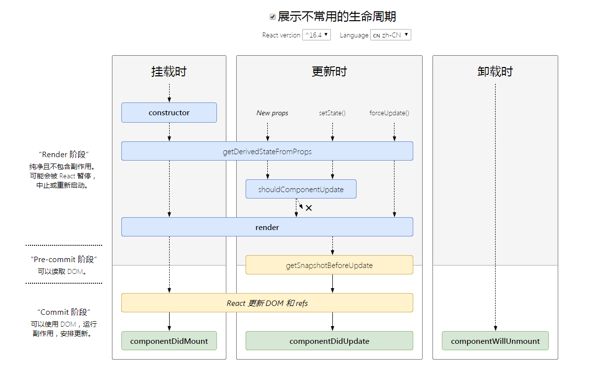

# React 相关问题

## 博客(Blog)

* [React之setState异步解释](./React之setState异步解释.md)
* [BPMN使用小结](./BPMN使用小结.md)

## React 生命周期



* constructor() 构造函数

```js
constructor(props) {
    super(props);
    this.state = {}
}
```

* static getDerivedStateFromProps() 初始挂载及后续更新时都会被调用，返回对象来更新 state，返回 null 表示不更新

```JS
static getDerivedStateFromProps(nextProps) {
    if ('value' in nextProps) {
        return {
            ...(nextProps.value || {})
        }
    }
    return null; // 返回 null，表示不更新
}
```

* render() 组件挂载DOM

```js
render () {
    return <Fragment></Fragment>
}
```

* componentDidMount() 组件挂载后执行

```js
componentDidMount() {
    // ...
}
```

* shouldComponentUpdate() 在渲染执行之前执行，默认返回 true，表示更新

* componentDidUpdate() 组件更新前执行，组件首次渲染时不执行

* componentWillUnmount() 组件卸载时执行，可停止定时器/清空 redux 数据

## 执行顺序

* 挂载

当组件实例被创建并插入 DOM 中时，其生命周期调用顺序如下：

```
constructor()
static getDerivedStateFromProps()
render()
componentDidMount()
```

* 更新

当组件的 props 或 state 发生变化时会触发更新。组件更新的生命周期调用顺序如下：

```
static getDerivedStateFromProps()
shouldComponentUpdate()
render()
getSnapshotBeforeUpdate()
componentDidUpdate()
```

* 卸载

当组件从 DOM 中移除时会调用如下方法：

```
componentWillUnmount()
```

* 错误处理

当渲染过程，生命周期，或子组件的构造函数中抛出错误时，会调用如下方法：

```
static getDerivedStateFromError()
componentDidCatch()
```

## Storybook for React

参考网址详见 [Storybook](https://storybook.js.org/docs/react/get-started/introduction)

```
npx sb init
npm run storybook
```

