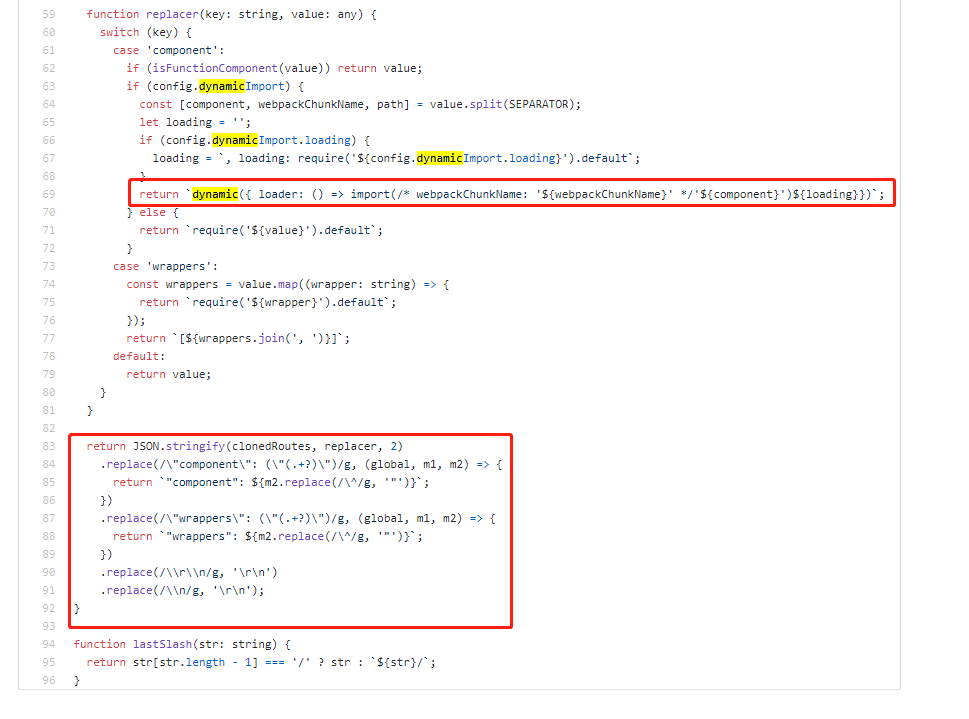
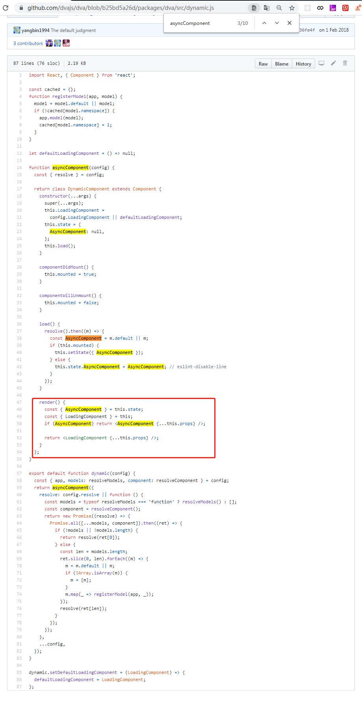

# umi

`umi` 是一个可插拔的企业级 `react` 应用框架，以路由为基础，支持路由级的按需加载。通过脚手架 `yarn create umi` 可快速搭建项目。

```
按目录约定注册 model，无需手动 app.model
文件名即 namespace，可以省去 model 导出的 namespace key
无需手写 router.js，交给 umi 处理，支持 model 和 component 的按需加载
内置 query-string 处理，无需再手动解码和编码
内置 dva-loading 和 dva-immer，其中 dva-immer 需通过配置开启
开箱即用，无需安装额外依赖，比如 dva、dva-loading、dva-immer、path-to-regexp、object-assign、react、react-dom 等
```

## 按需加载

* 通过 `umi/dynamic` 接口实现组件按需加载

```js
import dynamic from 'umi/dynamic';

const delay = (timeout) => new Promise(resolve => setTimeout(resolve, timeout));
const App = dynamic({
  loader: async function() {
    await delay(/* 1s */1000);
    return () => <div>I will render after 1s</div>;
  },
});
```

解析 `router.config.js` 路由数组，添加 `dynamic` 按需加载组件：



* `dva/dynamic` 解决组件动态加载问题

- 使用方式

```js
import dynamic from 'dva/dynamic';

const UserPageComponent = dynamic({
  app: require('@tmp/dva').getApp(), // dva 实例，加载 models 时需要
  models: () => [
    import('./models/users'),
  ], // 返回 Promise 数组的函数，Promise 返回 dva model
  component: () => import('./routes/UserPage'), // 返回 Promise 的函数，Promise 返回 React Component
});
```

- 解析源码 [dynamic.js](https://github.com/dvajs/dva/blob/b25bd5a26d/packages/dva/src/dynamic.js)

采用异步加载组件的方式



```js
_dvaDynamic({
  app: require('@tmp/dva').getApp(),
  models: () => [
    import(/* webpackChunkName: 'p__Dashboard__models__analysis.js' */ 'D:/cWorkshop/forceyu-system/src/pages/Dashboard/models/analysis.js').then(
      m => {
        return { namespace: 'analysis', ...m.default };
      },
    ),
  ],
  component: () => import(/* webpackChunkName: "p__Dashboard__Analysis" */ '../Dashboard/Analysis'),
  LoadingComponent: require('D:/cWorkshop/forceyu-system/src/components/PageLoading/index').default,
})
```

## react-router v4 路由按需加载

看了 `dva/dynamic` 之后才发现 `webpackChunkName` 是可以配置变量名的：'`${key.name}`'。将多个路由放在一个数组中，通过遍历数组来生成相应的路由，便于书写与维护，主要部分：
```js
asyncComponent(() =>import(/* webpackChunkName: '`${key.name}`' */ `@/pages/${key.name}`))
```

`react-router4` 不再推荐将所有路由规则放在同一个地方集中式路由，子路由应该由父组件动态配置，组件在哪里匹配就在哪里渲染，更加灵活。

```js
const Inbox = ({ match }) => (
  <div>
    <h2>Topics</h2>
    <Route path={`${match.url}/messages/:id`} component={Message}/>
  </div>
)
```

* asyncComponent.jsx

```js
/*
 * @Author: wqjiao
 * @Date: 2019-03-15 18:31:41
 * @Last Modified by: wqjiao
 * @Last Modified time: 2020-03-10 15:01:16
 * @Description: asyncComponent 实现组件按需加载 -- function
 */
import React, {Component} from 'react';

export default function asyncComponent(importComponent) {
    class AsyncComponent extends Component {
        constructor(props) {
            super(props);

            this.state = {
                component: null
            };
        }

        async componentDidMount() {
            const {default: component} = await importComponent();

            this.setState({component});
        }

        render() {
            const C = this.state.component;

            return C ? <C {...this.props} /> : null;
        }
    }

    return AsyncComponent;
}
```

* routeArray.js

```js
export default = [
    {
        name: 'AuditReadyList',
        path: '/audit-ready-list',
    },
    {
        name: 'HelpCenter',
        path: '/HelpCenter',
    }
];
```

* routes.js

```js
import React, {Component} from 'react';
import {HashRouter, Switch, Route, Redirect} from 'react-router-dom';
import asyncComponent from '@/utils/asyncComponent';
import routeArray from './routeArray'; // 路由数据
import Home from '@/pages/Home';
import NoMatch from '@/pages/NoMatch';

export default class Routes extends Component {
    render() {
        return (
            <HashRouter>
                <Switch>
                    <Route path="/" exact component={Home} />

                    {/* 页面路由集合 */}
                    {routeArray.map(item => {
                        return item.map(key => {
                            return (
                                <Route
                                    key={key.name}
                                    path={key.path}
                                    component={asyncComponent(() =>import(/* webpackChunkName: '`${key.name}`' */ `@/pages/${key.name}`))}
                                />
                            );
                        });
                    })}

                    <Route path="*" component={NoMatch} />
                    <Redirect to="/" />
                </Switch>
            </HashRouter>
        );
    }
}
```
