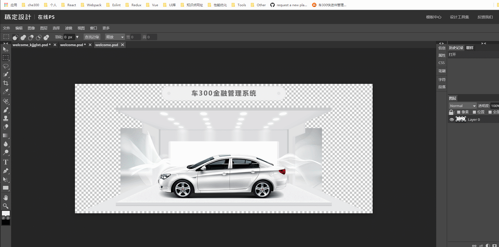
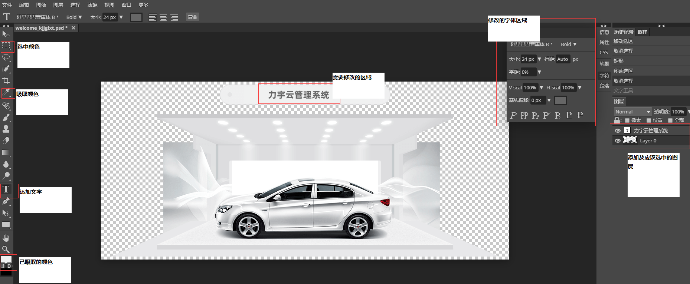

## 在线PS

关于 [在线PS地址](https://ps.gaoding.com) 的一些实际操作记录笔记

* 1.简单的修改 png 图片上的文案





- 1、吸管吸取指定区域颜色

- 2、添加文案(T) - 点击右侧字符

```
字体：阿里巴巴普惠体B-粗体

粗体：Bold

颜色： #666666

大小：24px

行距：Auto

字距：0%

基线偏移：0px
```

- 3、移动新文案位置

- 4、选中右侧大区域图层 - 框住文案区域 - Alt+del填充颜色
